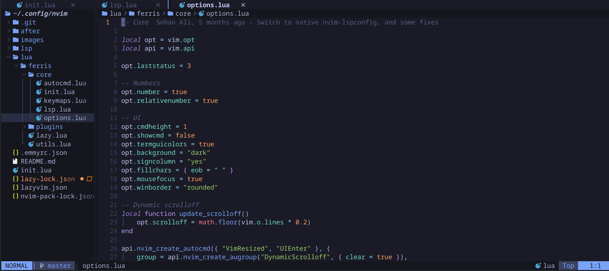

# 🦀 Ferris

A modern, highly optimized, and modular Neovim configuration written entirely in Lua. Built on Neovim 0.10+, **Ferris** is designed for extreme performance, clean layout, and rich aesthetics. It is particularly tailored for productive development in **Rust**, **C/C++**, **Python**, and **JavaScript/TypeScript**, and runs flawlessly in remote terminal environments and Termux.

<p align="center">
  
</p>

---

## ✨ Architectural & Design Philosophy

*   **Native Neovim 0.10+ LSP Loading**: Uses Neovim's native `vim.lsp.enable(...)` instead of bulky and heavy management plugins. Raw server configuration modules reside in `lsp/` and are autoloaded dynamically.
*   **Ultra-Fast Completion**: Powered by `blink.cmp` (the lightweight, lightning-fast modern successor to `nvim-cmp`) featuring custom fuzzy search tuning, signature help, and elegant rounded borders.
*   **Clipboard Isolation**: Standard deletions (`d`, `D`, `x`, `c` in Normal/Visual) target the black-hole register (`"_`) to protect your clipboard from pollution. Explicit copy operations are done via `<leader>y`, utilizing **unnamedplus** for robust, native system clipboard sync across local, remote (SSH), and multiplexed (tmux) terminals.
*   **Persistent & Re-usable Terminal Runner**: Features a custom non-blocking terminal runner in `lua/ferris/utils.lua` that tracks open interactive instances. This prevents window clutter and allows launching, focusing, and interactive execution (Cargo run, build, test, NPM start, etc.) in a single shared buffer.
*   **Dynamic UI Adjustments**: Adapts to your environment with features like viewport-relative dynamic scrolloff adjustment on resize and custom rounded UI boundaries.

---

## 📂 Repository Structure

The configuration is modularly split to ensure simplicity and clean separation of concerns:

```
~/.config/nvim/
├── init.lua                   # Lightweight entry point loading core & lazy
├── lazy-lock.json             # Precise commit lockfile for stable plugin environments
├── lazyvim.json               # Extra metadata configuration
├── lsp/                       # Raw language-specific LSP configuration modules
│   ├── clangd.lua
│   ├── lua_ls.lua
│   └── pyright.lua
├── after/ftplugin/            # Buffer-local mappings and runner actions per filetype
│   ├── c.lua / cpp.lua        # Intercept builds, Makefile triggers
│   ├── rust.lua               # Comprehensive cargo & rustaceanvim integrations
│   └── javascript.lua / ts.lua# NPM-specific quick triggers
└── lua/
    └── ferris/
        ├── init.lua           # Core load orchestrator
        ├── utils.lua          # Helper functions and non-blocking terminal manager
        ├── lazy.lua           # lazy.nvim initialization and RTP management
        ├── core/              # Core configuration
        │   ├── autocmd.lua    # Highlight-on-yank, global autocommands
        │   ├── init.lua       # Bootstrap core modules
        │   ├── keymaps.lua    # Global keymaps, unnamedplus, clipboard configuration
        │   └── options.lua    # Global vim.opt settings, diagnostic styling
        └── plugins/           # Individual, self-contained lazy.nvim specifications
            ├── blink.lua      # Completion engine
            ├── conform.lua    # Formatting-on-save
            ├── neogit.lua     # Full git porcelain interface
            └── ...            # Theme, statusline, telescope, dashboard, etc.
```

---

## ⚡ The Plugin Stack

| Domain | Plugin | Purpose / Role |
| :--- | :--- | :--- |
| **Package Management** | [lazy.nvim](https://github.com/folke/lazy.nvim) | Robust plugin manager with fast startup & automatic dependency handling. |
| **Completion & Snippets** | [blink.cmp](https://github.com/saghen/blink.cmp) | Next-generation, lightning-fast completion engine using Enter preset. |
| **LSP** | [nvim-lspconfig](https://github.com/neovim/nvim-lspconfig) | Core native configuration for Neovim's built-in LSP client. |
| | [rustaceanvim](https://github.com/mrcjkb/rustaceanvim) | Premium Rust support (expand macros, crate graphs, debug adapter setup). |
| **Formatting & Linting**| [conform.nvim](https://github.com/stevearc/conform.nvim) | Async formatting-on-save with `stylua`, `black`, `rustfmt`, and `prettier`. |
| | [nvim-lint](https://github.com/mfussenegger/nvim-lint) | Lightweight, asynchronous linter integration. |
| **Navigation & Search** | [telescope.nvim](https://github.com/nvim-telescope/telescope.nvim) | Extensible fuzzy finder over files, buffers, git histories, and diagnostics. |
| | [neo-tree.nvim](https://github.com/nvim-neo-tree/neo-tree.nvim) | Modern filesystem explorer with git status icons and diagnostics. |
| | [bufferline.nvim](https://github.com/akinsho/bufferline.nvim) | Clean tab bar for cycling, scoping, and keeping track of open buffers. |
| **Git Integration** | [neogit](https://github.com/NeogitOrg/neogit) | Full Magit-like Git porcelain with complete commit, branch, and push control. |
| | [diffview.nvim](https://github.com/sindrets/diffview.nvim) | Cycle through file history, visual diffs, and resolve merge conflicts. |
| | [gitsigns.nvim](https://github.com/lewis6991/gitsigns.nvim) | Live gutter changes, interactive hunk previews, and real-time blame. |
| **UI & Polish** | [tokyonight.nvim](https://github.com/folke/tokyonight.nvim) | Beautiful, high-contrast dark theme utilizing the "Night" style. |
| | [dashboard-nvim](https://github.com/nvimdev/dashboard-nvim) | Doom-style startup splash screen with performance indicators and quick actions. |
| | [lualine.nvim](https://github.com/nvim-lualine/lualine.nvim) | Fast, modular, and aesthetic status line. |
| | [fidget.nvim](https://github.com/j-hui/fidget.nvim) | Standalone LSP progress indicators and notification utility. |
| | [dropbar.nvim](https://github.com/Bekaboo/dropbar.nvim) | Dynamic IDE-like Winbar showing current code breadcrumbs. |
| | [statuscol.nvim](https://github.com/luukvbaal/statuscol.nvim) | Highly configurable column customization for line numbers, folds, and signs. |

---

## 🎹 Essential Keyboard Cheat Sheet

### 1. Global Navigation & Operations
*   `Space` (Leader Key): Pre-configured globally.
*   `<leader>w`: Save current file.
*   `<leader>q`: Force quit buffer.
*   `Shift + h` / `Shift + l`: Cycle to Previous / Next Buffer.
*   `<leader>bc`: Delete (close) current buffer.
*   `<leader>bo`: Close all other buffers except current.
*   `<Esc>`: Clear search highlighting.
*   `<leader>S`: Rename word under cursor globally in current buffer.
*   `<leader>dg`: Open floating line diagnostics.
*   `<leader>ut`: Toggle or focus custom background interactive Terminal.

### 2. Clipboard Sync (unnamedplus)
*   `<leader>y` (Normal & Visual): Explicitly Copy selection to the System Clipboard.
*   `d` / `D` / `x` / `c`: Standard deletions (No clipboard pollution).
*   `p` (Visual): Paste without overwriting your current register contents.

### 3. Telescope Fuzzy Finder
*   `<leader><space>`: Find file by name (replaces netrw / files search).
*   `<leader>/`: Live grep over entire workspace (requires `ripgrep`).
*   `<leader>fb`: Search currently open buffers.
*   `<leader>fr`: Search recently opened files (oldfiles).
*   `<leader>fg`: Search tracked git files.
*   `<leader>fk`: Explore available keymaps inside Neovim.
*   `<leader>fh`: Browse standard Vim help documentation tags.
*   `<leader>sd`: View workspace diagnostic listings.

### 4. Language & Environment Integrations

#### 🦀 Rust (Powered by `rustaceanvim`)
*   `<leader>a`: Execute context-aware Code Action.
*   `K`: Open hover documentation or diagnostic details.
*   `<leader>re`: Explain compiler error using standard rustc tool.
*   `<leader>rd`: Render diagnostic fully.
*   `<leader>rm`: Expand macro block under cursor.
*   `<leader>rr`: Find and run executable targets (Runnables).
*   `<leader>rl`: Rerun last selected runnable target.
*   `<leader>rt`: Interactive Cargo Test runner.
*   `<leader>rD`: Select and run debuggables with codeLLDB.
*   `<leader>cr`: Spawn persistent background execution via `cargo run`.
*   `<leader>cb`: Compile workspace using `cargo build`.
*   `<leader>ct`: Run `cargo test` with customized, interactive CLI arguments.

#### ⚙️ C / C++
*   `<leader>mi`: Run compiler intercept-build parsing via `intercept-build make -j2` to generate compilation databases.
*   `<leader>ma`: Interactively run Makefile with customizable CLI arguments.

#### 🌐 Web / JS / TS
*   `<leader>mp`: Fast run node project via `npm start`.

### 5. Git Porcelain (`neogit` & `diffview` & `gitsigns`)
*   `<leader>gg`: Open interactive Neogit control dashboard.
*   `<leader>gc`: Trigger Git commit split panel.
*   `<leader>gp`: Push current branch to remote origin.
*   `<leader>gl`: Pull current branch from remote origin.
*   `<leader>gd`: Open visual workspace-wide git diff panel.
*   `<leader>gD`: Open visual diff comparing against previous commit (`HEAD~1`).
*   `<leader>gh`: Show current file history and trace edits line-by-line.
*   `<leader>gH`: Show branch history visual timeline.
*   `<leader>gx`: Safely close open visual diff buffers.
*   `gp`: Preview currently modified hunk inline in current editor gutter.
*   `gs`: Toggle active Git sign columns.
*   `]h` / `[h`: Hop to Next / Previous modified Git hunk.

---

## 🚀 Installation & Requirements

### 1. Install Prerequisites
You will need a standard compiler toolchain, `git`, `make`, `ripgrep`, and language toolchains.

#### 📱 Termux / Debian / Ubuntu:
Run this single command to install all mandatory compiler, formatting, and analysis prerequisites:
```bash
apt update && yes | apt upgrade && apt update && yes | apt install build-essential zip termux-api gdu gdb gdbserver gh fd fzf neovim lua-language-server jq-lsp luarocks stylua ripgrep lazygit yarn python python-pip ccls clang zig rust-analyzer git ruby
```

### 2. Backup Current Configuration
To avoid clashes, back up your current Neovim settings:
```bash
mv ~/.config/nvim ~/.config/nvim.bak
mv ~/.local/share/nvim ~/.local/share/nvim.bak
mv ~/.local/state/nvim ~/.local/state/nvim.bak
mv ~/.cache/nvim ~/.cache/nvim.bak
```

### 3. Clone and Setup Ferris
Clone this repository to Neovim's user configuration directory:
```bash
git clone https://github.com/sohan-f/nvim.git ~/.config/nvim
```

### 4. Launch and Autoinstall
Simply open Neovim. `lazy.nvim` will launch automatically and bootstrap all plugins, compile native FZF elements, and sync configurations.
```bash
nvim
```

*Enjoy coding with Ferris! Feel free to fork and tailor the setup further to your preference!*
